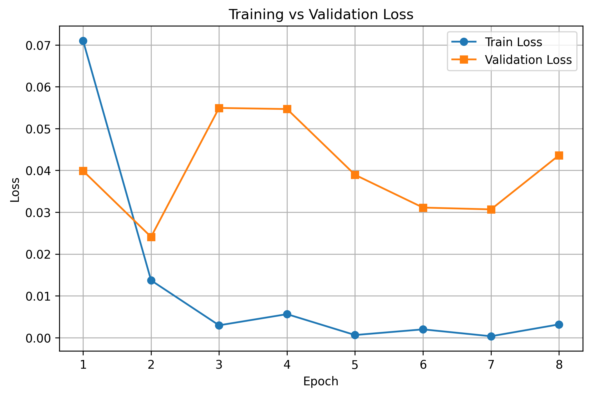

# Cats vs Dogs Classifier – 100% Accuracy on Kaggle

**Классификация изображений кошек и собак** с использованием Transfer Learning (ResNet50).  
Модель достигает 100% accuracy на валидационной выборке (на данном датасете).

## 📊 Результаты

## 🚀 Как запустить

1. **Скачать данные** с Kaggle: [Dogs vs Cats](https://www.kaggle.com/c/dogs-vs-cats/data)  
   Распаковать в папку `data/raw/` так, чтобы было:
