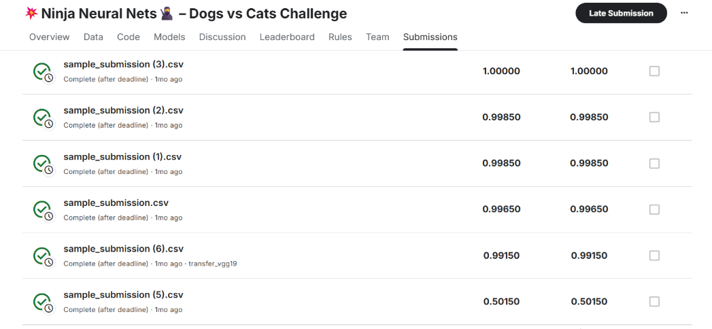

# Cats vs Dogs Classifier – 100% Accuracy on Kaggle

## 📄 Описание соревнования и данных (c сайта kaggle )

**🥷 Detailed Description**
Welcome to the 💥Ninja Neural Nets🥷 – Dogs vs Cats Challenge.

**🐱🐶 The Task**
Classify each test image as Cat (0) or Dog (1) using any model you like — CNNs, transfer learning, or your own ninja technique.

**📂 Data**
train/cats – 12,500 labeled images
train/dogs – 12,500 labeled images
test/ – unlabeled images for scoring
sample_submission.csv – shows the required id,label format

Unlabeled JPG images of cats and dogs mixed together
Filenames look like 1.jpg, 2.jpg, etc.
sample_submission.csv

A template showing the exact submission format: csv id,label 1.jpg,0 2.jpg,1

**🚀 How to Compete**
Create a Kaggle Notebook inside this competition.
Your full training & prediction code must run here.
Keep it public or private during the contest; it must be shareable if you win.
Generate the predictions and a CSV like:
   id,label
   1.jpg,0
   2.jpg,1
Submit both:

Notebook: click Save & Submit Notebook so reviewers can reproduce your results.
CSV File: upload your predictions on the Submissions page.
💡 Goal
Learn deep learning together — submit a working notebook and the CSV output to climb the leaderboard with ninja precision.

**Классификация изображений кошек и собак** с использованием Transfer Learning (ResNet50).  
Модель достигает 100% accuracy на тестовой выборке.

## ✅ Описание решения
1. В качестве архитектуры модели была использована предобученная *ResNet50* и *трансферное обучение*
2. Модель показала наилучший результат при 7 эпохах обучения

## 📊 Результаты

